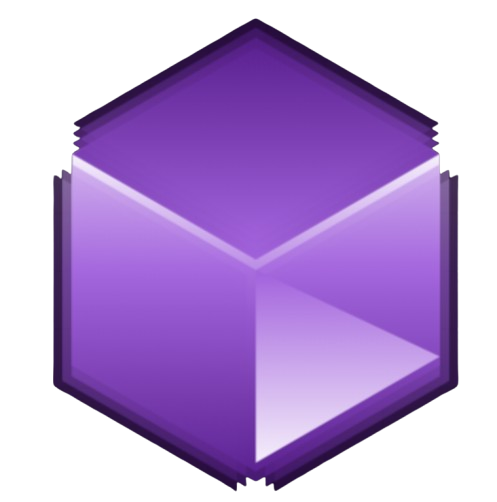

 

    

        
    

    

            <h3><b>MetaMaker</b></h3>
            
<i>A blockchain platform for collaborative game creation, governance, and ownership.</i>

    
      

 
<h1 align="center">MetaMaker</h1>

MetaMaker is a blockchain-based decentralized game development platform that allows players and developers to collaboratively create, govern, and own in-game assets and features. This platform would use blockchain to ensure transparent decision-making, reward contributions, and secure ownership of game elements.

## 📝 Table of Contents
- [General Information](#general-information)
- [Tech Stacks and Platforms](#tech-stacks-and-platforms)
- [High Level Design](#high-level-design)
- [Main Features](#main-features)
- [How to Run](#how-to-run)
- [Contributors](#contributors)

## 📢 General Information

<blockquote align='center'>
<h3>Refining Collaborative Application Development with Blockchain</h3>
</blockquote> 

Collaborative application development has become increasingly accessible, particularly with the rise of open-source platforms. These platforms allow anyone to modify an application to meet specific needs. If a modification proves valuable to a broader user base, the original developers can integrate it into the official version of the open-source application.  

However, this open-source model still faces several challenges:  
1. **Selection Process**: Determining which modifications to include in the official codebase can be subjective and time-consuming.  
2. **Component Tracking**: Ensuring transparency and traceability of open-source components in the codebase.  
3. **Workflow Automation**: Accelerating integration processes to enhance efficiency.  

To address these challenges, we propose a **blockchain-based fully public development method**. This method enables anyone to suggest program modifications by submitting them to the blockchain as a linked file (e.g., Google Drive link). Public voting will evaluate these proposals, with the highest-voted modification automatically integrated into the main codebase after a defined voting period.  

This blockchain-powered system offers:  
- Transparent decision-making through public voting.  
- Automated integration of top-voted modifications.  
- Enhanced traceability and accountability for submitted changes.  

Initially, this method is designed for blockchain-based game development, aiming to revolutionize how games are collaboratively developed, governed, and owned by communities.

## 👨🏻‍💻 Tech Stacks and Platforms

<a href="https://react.dev/">
<kbd>

</kbd>
</a>

<a href="https://www.typescriptlang.org/">
<kbd>

</kbd>
</a>

<a href="https://tailwindcss.com/">
<kbd>

</kbd>
</a>

<a href="https://ui.shadcn.com/">
<kbd>

</kbd>
</a>

<a href="https://expressjs.com/">
<kbd>

</kbd>
</a>

<a href="https://nodejs.org/en">
<kbd>

</kbd>
</a>

<kbd>

</kbd>

<kbd>

</kbd>

<kbd>

</kbd>

<kbd>

</kbd>

<kbd>

</kbd>

<kbd>

</kbd>

<kbd>

</kbd>

<h4>React | Typescript  | TailwindCSS | ShadcnUI | Express | NodeJS | Google Drive API | Github API | Solana | Ethereum | MetaMask | Ganache | Oracle</h4>

 

## 🏗️ High Level Design

MetaMaker's system consists of three main components: **Frontend (FE)**, **Backend/Oracle**, and **Smart Contract (SC)**.  

1. **Frontend (FE)**:  
   - Users can connect their wallets directly without involving the Backend.  
   - Users can view asset data by requesting information from the Backend, which retrieves it from the Smart Contract.  
   - To vote, users submit their votes via the Frontend, which sends them to the Smart Contract through the Backend/Oracle.  
   - After the voting period ends, the Frontend calls the Backend to execute the *declare winner* function on the Smart Contract and displays the results.  

2. **Backend/Oracle**:  
   - Acts as a bridge between external sources (e.g., Google Drive) and the Smart Contract.  
   - For asset submissions, the Backend uploads temporary files to Google Drive and stores the file link on the blockchain via the Smart Contract.  
   - The Backend also forwards user votes to the Smart Contract, retrieves voting results, and uploads the winning asset to a GitHub repository.  

3. **Smart Contract (SC)**:  
   - Stores asset data and voting results.  
   - Provides functions to view assets, cast votes, and declare the winner (*declare winner*).  
   - Serves as the central logic layer for interactions with the Frontend and Backend.  

This architecture ensures a transparent, secure, and decentralized workflow from asset submission to winner declaration.

## ⭐ Pages and Features
Here's MetaMaker's features and its interface.
<table style="width:100%; text-align:center;">
    <col width="49%">
    <col width="49%">
    <tr>
        <td width="1%" align="center"></td>
        <td width="1%" align="center"></td>
    </tr>
    <tr>
        <td width="1%" align="center">Home</td>
        <td width="1%" align="center">About</td>
    </tr>
    <tr>
        <td width="1%" align="center"></td>
        <td width="1%" align="center"></td>
    </tr>
    <tr>
        <td width="1%" align="center">Proposing Game Asset (1)</td>
        <td width="1%" align="center">Proposing Game Asset (2)</td>
    </tr>
    <tr>
        <td width="1%" align="center"></td>
        <td width="1%" align="center"></td>
    </tr>
    <tr>
        <td width="1%" align="center">Vote Asset</td>
        <td width="1%" align="center">Winner Announcement</td>
    </tr>
    <tr>
        <td width="1%" align="center"></td>
        <td width="1%" align="center"></td>
    </tr>
    <tr>
        <td width="1%" align="center">Patch State Management</td>
        <td width="1%" align="center">Some Decoration :D</td>
    </tr>
</table>

## 👏 Contributors
|SID|Contributor|
| :---: | --- |
| 13521063 | Salomo Reinhart Gregory Manalu  |
| 13521108 | Michael Leon Putra Widhi  |
| 13521172 | Nathan Tenka |
